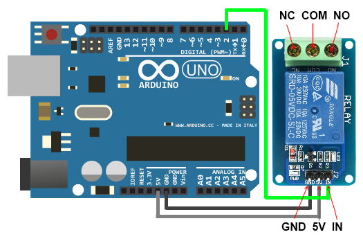

# Relay Module Library

For Arduino boards.

The Library implements a set of methods for working with a digital relay module.

Relay modules are assembled units commonly included with Optocouplers, diodes, 
LED’s, transistors, etc.. So, for the Arduino interfacing we just have to connect 
a supply voltage, GND and input signal connection.

## Installation

1. [Download](https://github.com/YuriiSalimov/RelayModule/releases) the Latest release from gitHub.
2. Unzip and modify the Folder name to "RelayModule" (Remove the '-version')
3. Paste the modified folder on your Library folder 
(On your `libraries` folder inside Sketchbooks or Arduino software).
4. Restart the Arduino IDE.

## Circuit Diagram

An input section of the relay module consists of three terminals VCC and GND and 
a signal input (IN).



If the load connection is between the COM and NC, the terminals will be closed for 
LOW state input signal and open during HIGH state input. Inversely, the HIGH state 
closes and LOW state opens for a connection between COM and NO.The output contacts 
of the module have three connections, labelled as Common (COM), Normal close (NC) 
and Normal open (NO).

## Methods

```cpp
	/**
		DIGITAL_PIN - a digital port pin that 
		is attached to the relay.
	*/
	RelayModule relay(DIGITAL_PIN);
	
	/**
		If you need to invert a sensor signal:
		INVERT_SIGNAL:
			true - invert a signal;
			false - not invert a signal.
	*/
	RelayModule relay(DIGITAL_PIN, INVERT_SIGNAL);

	// Turns ON the relay if it is off.
	relay.on();
	
	// Turns OFF the relay if it is on.
	relay.off();
	
	/**
		Checks if the relay is ON.
		Return true if the relay is on, 
		false if the relay is off.
	*/
	relay.isOn();
	
	/**
		Checks if the relay is OFF.
		Return true if the relay is off, 
		false if the relay is on.
	*/
	relay.isOff();
```

Created by Yurii Salimov.
